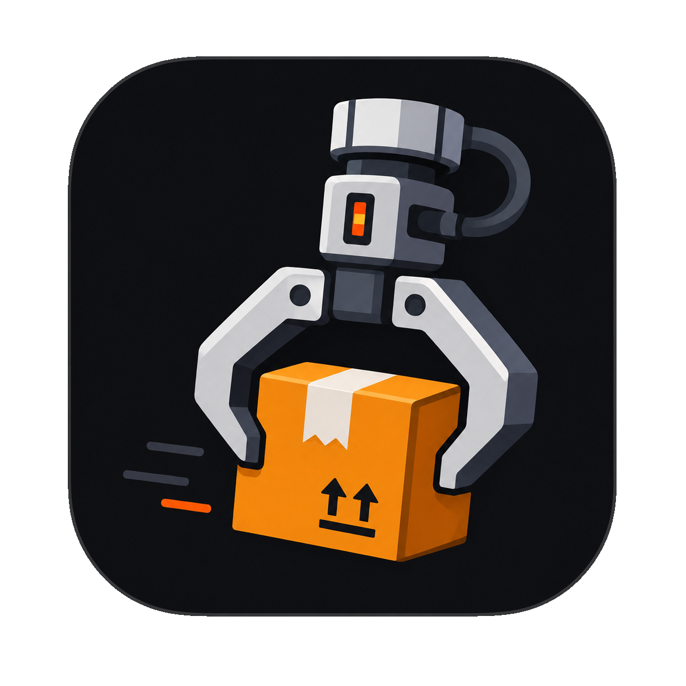

<p align="center">
  
</p>

<h1 align="center">Snatcharr</h1>

<p align="center">
  Self-hosted Usenet search &amp; grab manager for Jellyfin home labs
</p>

<p align="center">
  <a href="https://hub.docker.com/r/baervers23/snatcharr">Docker Hub</a> ·
  <a href="#quick-start-docker-compose--image">Quick start</a> ·
  <a href="#features">Features</a> ·
  <a href="#screenshots">Screenshots</a> ·
  <a href="#build-the-docker-image">Build</a> ·
  <a href="#development">Development</a> ·
  <a href="#environment-variables">Environment</a> ·
  <a href="#reverse-proxy">Reverse proxy</a> ·
  <a href="#troubleshooting">Troubleshoot</a> ·
  <a href="https://github.com/baervers23/snatcharr/releases">Releases</a> ·
  <a href="#license">License</a>
</p>

<p align="center">
  <a href="https://github.com/baervers23/snatcharr/releases"></a>
  <a href="https://github.com/baervers23/snatcharr/stargazers"></a>
  <a href="https://github.com/baervers23/snatcharr/network/members"></a>
  <a href="https://github.com/baervers23/snatcharr/issues"></a>
  <a href="https://github.com/baervers23/snatcharr/blob/main/README.md#license"></a>
</p>

<p align="center">
  <a href="https://hub.docker.com/r/baervers23/snatcharr"></a>
  <a href="https://hub.docker.com/r/baervers23/snatcharr"></a>
  <a href="https://hub.docker.com/r/baervers23/snatcharr"></a>
</p>

**v0.9.3** — A self-hosted Usenet search and grab manager for home labs and Jellyfin setups.

Search releases through Prowlarr, send NZBs to SABnzbd or NZBGet, track grabs, and manage users with daily limits. Built with Next.js 15, SQLite, and Auth.js.

---

## Screenshots

<table>
  <tr>
    <td width="50%">
      
      <p align="center"><sub><sub><sub><b>Login</b> — local &amp; external auth (Jellyfin, Seerr, Organizr, JFA-GO)</sub></sub></sub></p>
    </td>
    <td width="50%">
      
      <p align="center"><sub><sub><sub><b>Security</b> — grants, search filters, rate limits &amp; auth apps</sub></sub></sub></p>
    </td>
  </tr>
  <tr>
    <td width="50%">
      
      <p align="center"><sub><sub><sub><b>System</b> — health checks, disk usage, logs, audit &amp; backup</sub></sub></sub></p>
    </td>
    <td width="50%">
      
      <p align="center"><sub><sub><sub><b>Users</b> — roles, limits, grants &amp; sync from Jellyfin / Seerr</sub></sub></sub></p>
    </td>
  </tr>
  <tr>
    <td width="50%">
      
      <p align="center"><sub><sub><sub><b>Users</b> — grab/download/upload grants &amp; per-user limits</sub></sub></sub></p>
    </td>
    <td width="50%">
      
      <p align="center"><sub><sub><sub><b>Stats</b> — activity, success rate &amp; user rankings</sub></sub></sub></p>
    </td>
  </tr>
  <tr>
    <td width="50%">
      
      <p align="center"><sub><sub><sub><b>Grabs</b> — completed downloads &amp; time-limited file links</sub></sub></sub></p>
    </td>
    <td width="50%">
      
      <p align="center"><sub><sub><sub><b>Email</b> — SMTP setup &amp; new-user notifications</sub></sub></sub></p>
    </td>
  </tr>
</table>

---

## Features

- **Setup wizard** — admin account, Prowlarr indexer, download client, optional auth apps
- **Search** — Prowlarr integration, categories, grab confirmation, optional download-client picker
- **Grabs** — status tracking, file browser, time-limited downloads
- **Upload NZB** — manual NZB/link upload (grant-based), tips for Usenet indexers
- **Users** — roles, per-user limits, grab/download/upload grants, Jellyfin/Seerr sync
- **Auth** — local, Jellyfin, Seerr, Organizr (API + SSO), JFA-GO; users imported on first login
- **Settings** — general, email/SMTP, search filters, security, indexers, clients, apps
- **Profile** — email, password, limits, notification preferences
- **Stats** — personal usage; admin rankings
- **System** — health checks, tasks, live logs, audit trail, backup & restore (primary admin)
- **Security** — API keys never returned to the client, connection test before saving keys, rate limits

**You still need:** [Prowlarr](https://github.com/Prowlarr/Prowlarr) and a Usenet client such as [SABnzbd](https://sabnzbd.org/) or NZBGet.

---

## Quick start (Docker Compose — image)

**Requirements:** Docker and Docker Compose v2.

```bash
git clone https://github.com/baervers23/snatcharr.git
cd snatcharr

cp .env.example .env
```

Edit `.env`:

1. Set `AUTH_SECRET` to a random string:
   ```bash
   openssl rand -base64 32
   ```
2. Set `AUTH_URL` to the URL you open in the browser (e.g. `http://192.168.1.10:3000`).
3. Set `PUID` / `PGID` to match your data folders (`id -u` / `id -g`).
4. Adjust the volume paths in `docker-compose.yml` if needed (defaults: `./snatcharr-data` → `/app/data`, and your download host path → `/downloads`).

```bash
docker compose pull
docker compose up -d
```

The compose file uses **`baervers23/snatcharr:latest`** by default.

Open the URL from `AUTH_URL` and complete the **setup wizard**.

### Useful commands

```bash
docker compose logs -f snatcharr
docker compose ps
docker compose pull && docker compose up -d    # update to latest image tag
docker compose down
```

## Reverse proxy

By default the app publishes port **3000**. Put it behind Nginx Proxy Manager, Traefik, etc.:

1. Point the proxy at `http://snatcharr:3000` on the `snatcharr` Docker network.
2. Set `AUTH_URL` to your public HTTPS URL.
3. Optionally remove the `ports:` mapping and attach an external proxy network (see comments in `docker-compose.yml`).

### Optional Redis

Not required for normal use:

```bash
docker compose --profile redis up -d
```

---

## Build the Docker image

To build and publish the image yourself (or run from source):

```bash
docker build -t baervers23/snatcharr:latest --build-arg APP_VERSION=0.9.3 .
```

Run locally without pushing:

```bash
docker run -d \
  --name snatcharr \
  -p 3000:3000 \
  --env-file .env \
  -v "$(pwd)/data:/app/data" \
  -v "$(pwd)/downloads:/downloads" \
  baervers23/snatcharr:latest
```

Push to a registry (after `docker login`):

```bash
docker push baervers23/snatcharr:latest
```

To use your own build in Compose, comment out `image:` and uncomment the `build:` block in `docker-compose.yml`.

---

## Run without Docker

**Requirements:** Node.js **22+**, npm.

```bash
git clone https://github.com/baervers23/snatcharr.git
cd snatcharr

npm install
cp .env.local.example .env.local
```

Edit `.env.local` — set `AUTH_SECRET` (see above).

```bash
npm run build
npm run start
```

Open [http://localhost:3000](http://localhost:3000) and run the setup wizard.

Data is stored under `./data` (SQLite, `config.json`, logs). Create `./downloads` if you want a local grab folder.

---

## Development

```bash
npm install
cp .env.local.example .env.local
# Set AUTH_SECRET in .env.local
npm run dev
```

| Command | Description |
| --- | --- |
| `npm run dev` | Dev server with hot reload |
| `npm run build` | Production build |
| `npm run start` | Run production build |
| `npm run lint` | ESLint |
| `npm run db:studio` | Drizzle Studio (SQLite) |
| `npm run clean:zone-ids` | Remove Windows `Zone.Identifier` junk files |

DB migrations run automatically on startup (`instrumentation.ts`).

---

## Environment variables

### Docker (`.env`)

| Variable | Required | Description |
| --- | --- | --- |
| `AUTH_URL` | Yes | Public app URL |
| `AUTH_SECRET` | Yes | Session signing key |
| `PUID` / `PGID` | Yes | Container user — match volume ownership |
| `PORT` | No | Published port (default `3000`) |
| `DATABASE_URL` | No | Default `file:/app/data/snatcharr.db` |
| `APP_VERSION` | No | Build label (Docker build arg) |

Host data/download paths are set in `docker-compose.yml` volumes (`./snatcharr-data` → `/app/data`, download path → `/downloads`), not via env vars.

SMTP and most options are configured in **Settings** after setup.

### Local dev (`.env.local`)

| Variable | Required | Description |
| --- | --- | --- |
| `AUTH_URL` | Yes | Usually `http://localhost:3000` |
| `AUTH_SECRET` | Yes | Session signing key |
| `DATABASE_URL` | No | Default `file:./data/snatcharr.db` |

---

## Troubleshooting

**Reset admin password (re-run setup)**  
Stop the container, then edit your data `config.json` (e.g. `./data/config.json`):

```json
"setupComplete": false
```

Restart Snatcharr and open `/setup`. Step 1 lets you set a **new admin username and password** (user id `1` is updated). Clear the browser cookie `snatcharr-setup` if you are not redirected automatically.

**`SQLITE_READONLY` or permission errors (Docker)**  
Set `PUID`/`PGID` to the owner of your data folders, then restart. On NFS/NAS:

```bash
sudo chown -R "$PUID:$PGID" ./data ./downloads
```

**Logged out after changing `AUTH_SECRET`**  
Expected — all sessions are invalidated.

**CSS `@theme` warnings in the editor**  
Tailwind v4 syntax; safe to ignore. Workspace settings already suppress the linter noise.

---

## License

MIT
